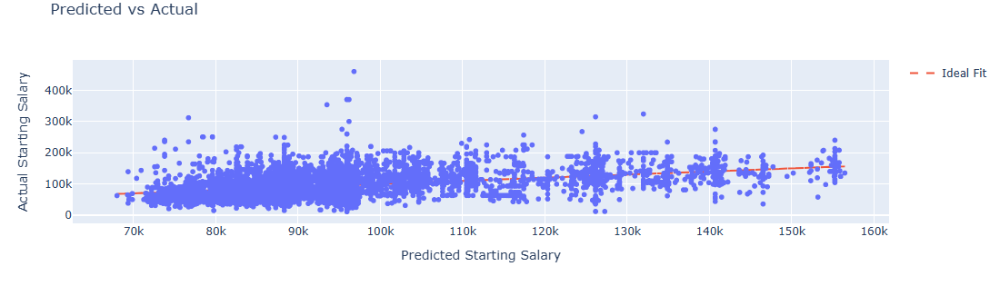
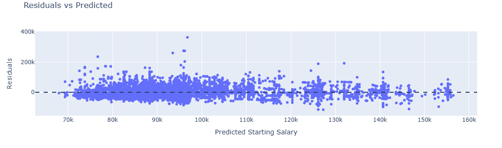
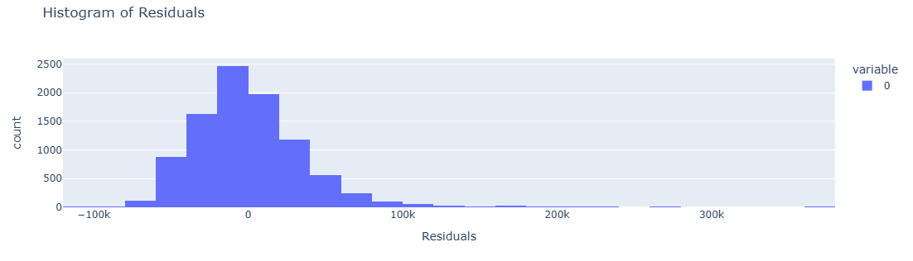
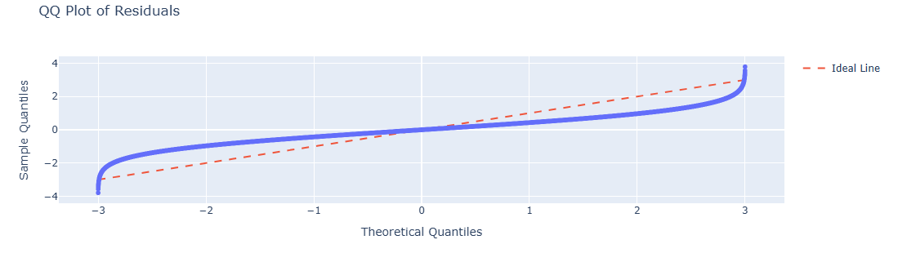

# Jason Stopas lab 08
---

The Predicted vs. Actual scatter plot, with the Ideal Fit line, visually shows the interpreter a comparison (the accuracy) between inputs.  For the dots on or near the Ideal Fit line the model predicted the starting salary fittingly, the dots above the Ideal Fit line are underpredicted (salaries were higher than expected), and dots below the line are overpredicted (salaries were lower than expected).
___

The Residuals vs Predicted plot, with a dashed line representing exact forecasts, shows the viewer the measured residuals (actual – predicted) of this regression model.  It's easy to spot a ‘handful’ of underpredicted values around the 95K mark, which is interesting, but with no other clear or obvious patterns that would suggest non-linearity.          
___

The Histogram of Residuals visually shows us the distribution of the residuals, as suggested.  Generally, this plot shows the viewer the occurrences are 'visually' close to normally distributed, but with some right skew present.
___

The Quantile-Quantile plot is another way to check on the distribution of the residuals.  This one shows us an obvious S-shape that is consistent with right-skewness and also some strong tails, on both ends, that are likely due to a repeated occurrence of outliers, both positive and negative.  
___
